# Http Protocol

# 第1章 了解web及网络基础

## 1.1 web与http的关系

Web 使用一种名为 HTTP（HyperText Transfer Protocol，超文本传输协议）的协议作为规范，完成从客户端到服务器端等一系列运作流程。可以说，Web 是建立在 HTTP 协议上通信的。

> HTTP通常被译为超文本传输协议，但这种译法并不严谨。严谨的译名应该为“超文本转移协议”。

## 1.2 HTML的诞生

### 1.2.1 为知识共享而规划Web

1989 年 3 月，互联网还只属于少数人。在这一互联网的黎明期，HTTP 诞生了。

最初设想的基本理念是：借助多文档之间相互关联形成的超文本（HyperText），连成可相互参阅的 WWW（World Wide Web，万维网）。

现在已提出了 3 项 WWW 构建技术，分别是：

1. 把 SGML（Standard Generalized Markup Language，标准通用标记语言）作为页面的文本标记语言的 HTML（HyperText Markup Language，超文本标记语言）；
2. 作为文档传递协议的 HTTP；
3. 指定文档所在地址的 URL（Uniform Resource Locator，统一资源定位符）

HTML代表“超文本标记语言”。它是用于创建和设计网页的标准标记语言。HTML提供了一组元素或标记来构建网页上的内容，如标题、段落、链接、图像等。

## 1.3 网络基础 TCP/IP

为了理解 HTTP，我们有必要事先了解一下 TCP/IP 协议族。

通常使用的网络（包括互联网）是在 TCP/IP 协议族的基础上运作的。而 HTTP 属于它内部的一个子集。

### 1.3.1 TCP/IP的概念

计算机与网络设备要相互通信，双方就必须基于相同的方法。比如，如何探测到通信目标、由哪一边先发起通信、使用哪种语言进行通信、怎样结束通信等规则都需要事先确定。不同的硬件、操作系统之间的通信，所有的这一切都需要一种规则。而我们就把这种==规则称为协议（protocol）==。


​															TCP/IP 是互联网相关的各类协议族的总称

像这样把与互联网相关联的协议集合起来总称为 TCP/IP （Transmission Control Protocol/Internet Protocol）。也有说法认为，TCP/IP 是指 TCP 和 IP 这两种协议。还有一种说法认为，TCP/IP 是在 IP 协议的通信过程中，使用到的协议族的统称。

### 1.3.2 TCP/IP 的分层管理

TCP/IP 协议族里重要的一点就是分层。TCP/IP 协议族按层次分别分为以下 4 层：==应用层、传输层、网络层和数据链路层==。

把 TCP/IP 层次化是有好处的。比如，如果互联网只由一个协议统筹，某个地方需要改变设计时，就必须把所有部分整体替换掉。而分层之后只需把变动的层替换掉即可。把各层之间的接口部分规划好之后，==每个层次内部的设计就能够自由改动了。==

值得一提的是，==层次化之后，设计也变得相对简单了==。处于应用层上的应用可以只考虑分派给自己的任务，而不需要弄清对方在地球上哪个地方、对方的传输路线是怎样的、是否能确保传输送达等问题。

#### TCP/IP 协议族各层的作用如下。

1. 应用层
   * 应用层决定了==向用户提供应用服务时通信的活动==。
   * TCP/IP 协议族内预存了各类通用的应用服务。比如，FTP（File Transfer Protocol，文件传输协议）和 DNS（Domain Name System，域名系统）服务就是其中两类。
   * HTTP 协议也处于该层。
2. 传输层
   * 传输层对上层应用层，提供处于网络连接中的两台计算机之间的==数据传输==。
   * 在传输层有两个性质不同的协议：TCP（Transmission Control Protocol，传输控制协议）和 UDP（User Data Protocol，用户数据报协议）。
3. 网络层（又名网络互连层）
   * 网络层用来==处理在网络上流动的数据包==。数据包是网络传输的最小数据单位。该层规定了通过怎样的路径（所谓的传输路线）到达对方计算机，并把数据包传送给对方。
   * 与对方计算机之间通过多台计算机或网络设备进行传输时，网络层所起的作用就是在众多的选项内==选择一条传输路线。==
4. 链路层（又名数据链路层，网络接口层）
   * 用来处理连接网络的==硬件部分==。包括控制操作系统、硬件的设备驱动、NIC（Network Interface Card，网络适配器，即网卡），及光纤等物理可见部分（还包括连接器等一切传输媒介）。硬件上的范畴均在链路层的作用范围之内。

### 1.3.3 TCP/IP 通信传输流

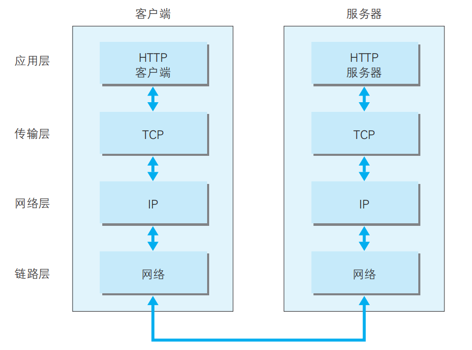

  利用 TCP/IP 协议族进行网络通信时，会通过分层顺序与对方进行通信。发送端从应用层往下走，接收端则往应用层往上走。
  我们用 HTTP 举例来说明，首先作为发送端的客户端在应用层（HTTP 协议）发出一个想看某个 Web 页面的 HTTP 请求。
  接着，为了传输方便，在传输层（TCP 协议）把从应用层处收到的数据（HTTP 请求报文）进行分割，并在各个报文上==打上标记序号及端口号==后转发给网络层。
  在网络层（IP 协议），==增加作为通信目的地的 MAC 地址==后转发给链路层。这样一来，发往网络的通信请求就准备齐全了。

  接收端的服务器在链路层接收到数据，按序往上层发送，一直到应用层。当传输到应用层，才能算真正接收到由客户端发送过来的 HTTP请求。

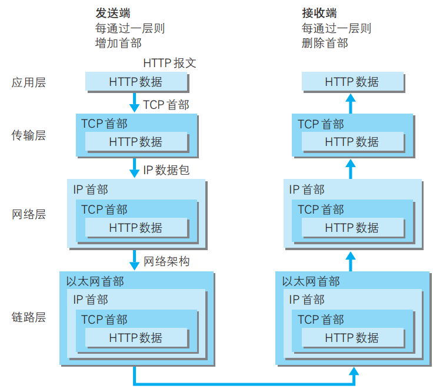

==发送端==在层与层之间传输数据时，==每经过一层时必定会被打上一个该层所属的首部信息==。反之，==接收端==在层与层传输数据时，==每经过一层时会把对应的首部消去==。这种把数据信息包装起来的做法称为封装（encapsulate）。

## 1.4 与 HTTP 关系密切的协议：IP、TCP 和 DNS

下面我们分别针对在 TCP/IP 协议族中与 HTTP 密不可分的 3 个协议（IP、TCP 和 DNS）进行说明。

### 1.4.1 负责传输的 IP 协议

IP（Internet Protocol）网际协议位于网络层。几乎所有使用网络的系统都会用到 IP 协议。TCP/IP 协议族中的 IP 指的就是网际协议，协议名称中占据了一半位置，其重要性可见一斑。

> 可能有人会把“IP”和“IP 地址”搞混，“IP”其实是一种协议的名称。

==IP 协议的作用是把各种数据包传送给对方==。而要保证确实传送到对方那里，则需要满足各类条件。其中两个重要的条件是 IP 地址和 MAC地址（Media Access Control Address）。

IP 地址指明了节点被分配到的地址，MAC 地址是指网卡所属的固定地址。IP 地址可以和 MAC 地址进行配对。==IP 地址可变换，但 MAC地址基本上不会更改==。

> ***使用 ARP 协议凭借 MAC 地址进行通信***
>
> IP 间的通信依赖 MAC 地址。在网络上，通信的双方在同一局域网（LAN）内的情况是很少的，通常是经过多台计算机和网络设备中转才能连接到对方。而在进行中转时，会利用下一站中转设备的 MAC 地址来搜索下一个中转目标。这时，会采用 ARP 协议（Address Resolution Protocol）。ARP 是一种用以解析地址的协议，根据通信方的 IP 地址就可以反查出对应的 MAC 地址。
>
> 
>
> ***没有人能够全面掌握互联网中的传输状况***
>
> 在到达通信目标前的中转过程中，那些计算机和路由器等网络设备只能获悉很粗略的传输路线。
>
> 这种机制称为路由选择（routing），有点像寄快递。我们是想通过这个比喻说明，无论哪台计算机、哪台网络设备，它们都无法全面掌握互联网中的细节。
>
> 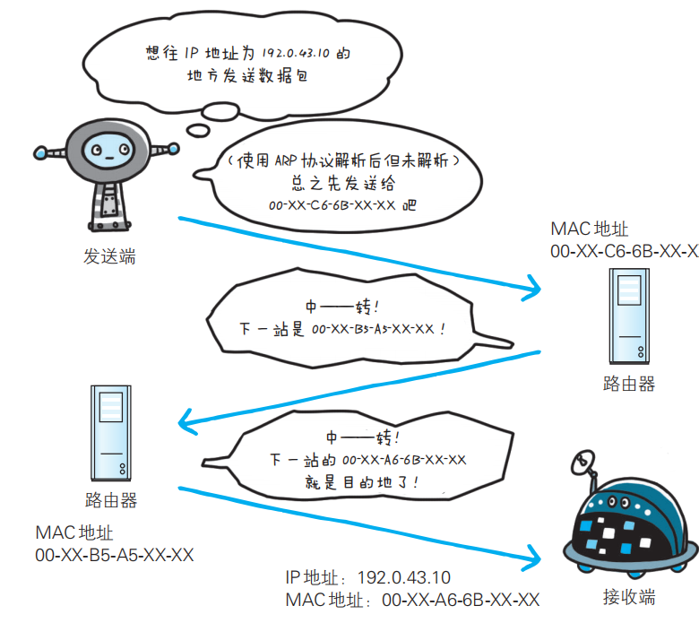


### 1.4.2 确保可靠性的 TCP 协议

TCP 位于传输层，提供可靠的字节流服务。

所谓的字节流服务（Byte Stream Service）是指，为了方便传输，将大块数据分割成以报文段（segment）为单位的数据包进行管理。而可靠的传输服务是指，能够把数据准确可靠地传给对方。一言以蔽之，TCP 协议为了更容易传送大数据才==把数据分割==，而且 TCP 协议==能够确认数据最终是否送达到对方==。

> ***确保数据能到达目标***
>
> 为了准确无误地将数据送达目标处，TCP 协议采用了三次握手（three-way handshaking）策略。用 TCP 协议把数据包送出去后，TCP不会对传送后的情况置之不理，它一定会向对方确认是否成功送达。握手过程中使用了 TCP 的标志（flag）——SYN（synchronize）和 ACK（acknowledgement）。
>
> 发送端首先发送一个带 SYN 标志的数据包给对方。接收端收到后，回传一个带有 SYN/ACK 标志的数据包以示传达确认信息。最后，发送端再回传一个带 ACK 标志的数据包，代表“握手”结束。
>
> 若在握手过程中某个阶段莫名中断，TCP 协议会再次以相同的顺序发送相同的数据包。
>
> 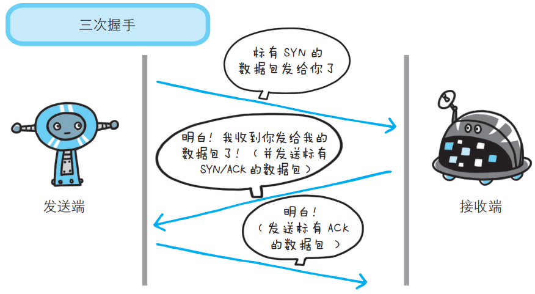
>
> 除了上述三次握手，TCP 协议还有其他各种手段来保证通信的可靠性。

## 1.5 负责域名解析的 DNS 服务

DNS（Domain Name System）服务是和 HTTP 协议一样位于应用层的协议。它提供域名到 IP 地址之间的解析服务。

计算机既可以被赋予 IP 地址，也可以被赋予主机名和域名。比如www.hackr.jp。

但要让计算机去理解名称，相对而言就变得困难了。因为计算机更擅长处理一长串数字。

为了解决上述的问题，DNS 服务应运而生。DNS 协议提供通过域名查找 IP 地址，或逆向从 IP 地址反查域名的服务。

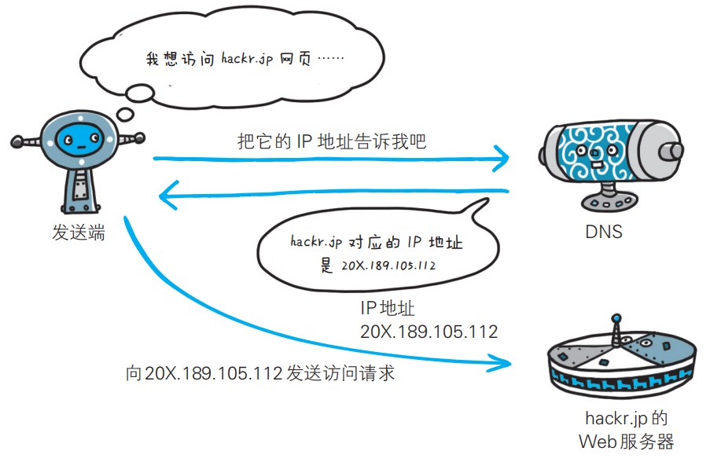

## 1.6 各种协议与 HTTP 协议的关系

我们再通过这张图来了解下 IP 协议、TCP 协议和 DNS 服务在使用HTTP 协议的通信过程中各自发挥了哪些作用。

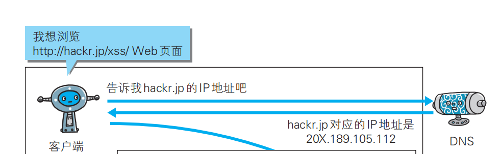

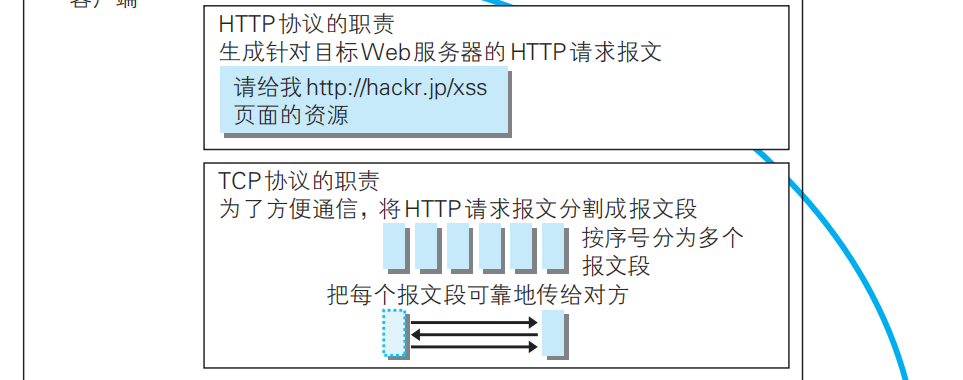

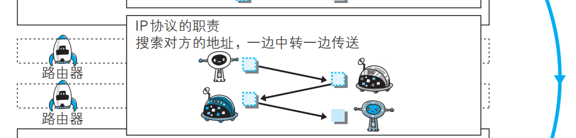

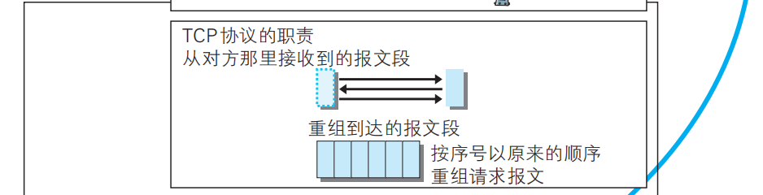

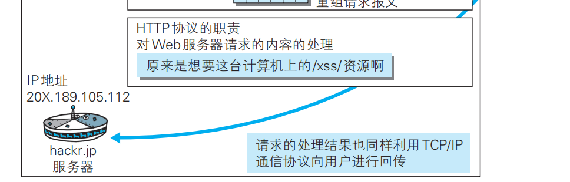

## 1.7 URI 和 URL

与 URI（统一资源标识符）相比，我们更熟悉 URL（Uniform Resource Locator，统一资源定位符）。

### 1.7.1 统一资源标识符

URI 是 Uniform Resource Identifier 的缩写。RFC2396 分别对这 3 个单词进行了如下定义。

>  ***Uniform***
>
> 规定统一的格式可方便处理多种不同类型的资源，而不用根据上下文环境来识别资源指定的访问方式。另外，加入新增的协议方案（如 http: 或 ftp:）也更容易。
>
> ***Resource***
>
> 资源的定义是“可标识的任何东西”。除了文档文件、图像或服务（例如当天的天气预报）等能够区别于其他类型的，全都可作为资源。另外，资源不仅可以是单一的，也可以是多数的集合体。
>
> ***Identifier***
>
> 表示可标识的对象。也称为标识符。

综上所述，URI 就是由某个协议方案表示的资源的定位标识符。协议方案是指访问资源所使用的协议类型名称。

采 用 HTTP 协 议 时， 协 议 方 案 就 是 http。 除 此 之 外， 还 有 ftp、mailto、telnet、file 等。标准的 URI 协议方案有 30 种左右，由隶属于国际互联网资源管理的非营利社团 ICANN（Internet Corporation for Assigned Names and Numbers，互联网名称与数字地址分配机构）的 IANA（Internet Assigned Numbers Authority，互联网号码分配局）管理颁布。

URI 用字符串标识某一互联网资源，而 URL 表示资源的地点（互联网上所处的位置）。可见 ==URL 是 URI 的子集==。

“RFC3986：统一资源标识符（URI）通用语法”中列举了几种 URI 例子，如下所示。

```txt
//ftp.is.co.za/rfc/rfc1808.txt
http://www.ietf.org/rfc/rfc2396.txt
ldap://[2001:db8::7]/c=GB?objectClass?one
mailto:John.Doe@example.com
news:comp.infosystems.www.servers.unix
tel:+1-816-555-1212
telnet://192.0.2.16:80/
urn:oasis:names:specification:docbook:dtd:xml:4.1.2
```

### 1.7.2 URI 格式

表示指定的 URI，要使用涵盖全部必要信息的绝对 URI、绝对 URL 以及相对 URL。相对 URL，是指从浏览器中基本 URI 处指定的 URL，形如 /image/logo.gif。

让我们先来了解一下绝对 URI 的格式。

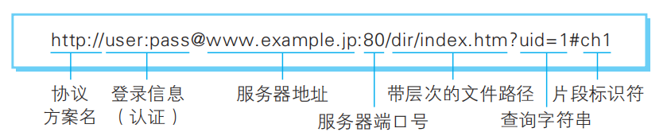

使用 http: 或 https: 等协议方案名获取访问资源时要指定协议类型。不区分字母大小写，最后附一个冒号（:）。

> ***登录信息（认证）***
>
> 指定用户名和密码作为从服务器端获取资源时必要的登录信息（身份认证）。此项是可选项。
>
> 
>
> ***服务器地址***
>
> 使用绝对 URI 必须指定待访问的服务器地址。地址可以是类似 hackr.jp 这种 DNS 可解析的名称，或是 192.168.1.1 这类 IPv4 地址名，还可以是 [0:0:0:0:0:0:0:1] 这样用方括号括起来的 IPv6 地址名。
>
> ***服务器端口号***
>
> 指定服务器连接的网络端口号。此项也是可选项，若用户省略则自动使用默认端口号。
>
> 
>
> ***带层次的文件路径***
>
> 指定服务器上的文件路径来定位特指的资源。这与 UNIX 系统的文件目录结构相似。
>
> 
>
> ***查询字符串***
>
> 针对已指定的文件路径内的资源，可以使用查询字符串传入任意参数。此项可选。
>
> 
>
> ***片段标识符***
>
> 使用片段标识符通常可标记出已获取资源中的子资源（文档内的某个位置）。但在 RFC 中并没有明确规定其使用方法。该项也为可选项。


# 第2章 简单的HTTP协议


